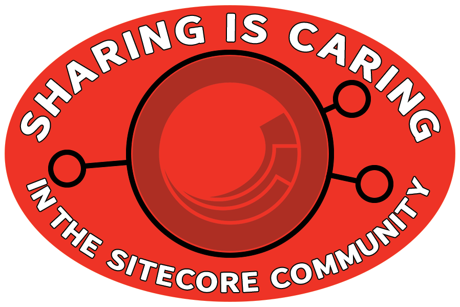

# Stickers from SUGCON 2019

In case anyone wants to print their own copies of the stickers I had at SUGCON this year, here's all the artwork.

The files are available in Photoshop format, and as PNGs below.
They're under an "<a href="http://creativecommons.org/licenses/by-sa/4.0/">attribution, share-alike</a>" license so if you've got customisations you'd like to make, go ahead.
Just give the artwork back to the community and link back to this repo.

For the event, I used <a href="https://www.stickermule.com/uk/custom-stickers">Sticker Mule</a> to print copies of these, and the quality was great.
It's a bit hidden, but they also have <a href="https://www.stickermule.com/samples/stickers">an "order samples" option</a>, which lets you get smaller numbers if you only need a few (or to check out your designs).

## The files

1. **Love Sitecore** 
     
    [<a href="HollowHeart.psd">PSD File</a>]

2. **MVP Embargo** 
     
    [<a href="Construct.psd">PSD File</a>]

3. **Jerm Free** 
     
    [<a href="JermFree.psd">PSD File</a>]

4. **Sharing is caring (Rectangular)** 
     
    [<a href="SharingIsCaring-Rectangle.psd">PSD File</a>] 

5. **Sharing is caring (Oval)** 
     
    [<a href="SharingIsCaring-RedOval.psd">PSD File</a>] 

5. **Sorry** 
     
    [<a href="Sorry.psd">PSD File</a>] 

----

Logos used here belong to their respective companies.

----

 This work is licensed under a <a rel="license" href="http://creativecommons.org/licenses/by-sa/4.0/">Creative Commons Attribution-ShareAlike 4.0 International License</a>.